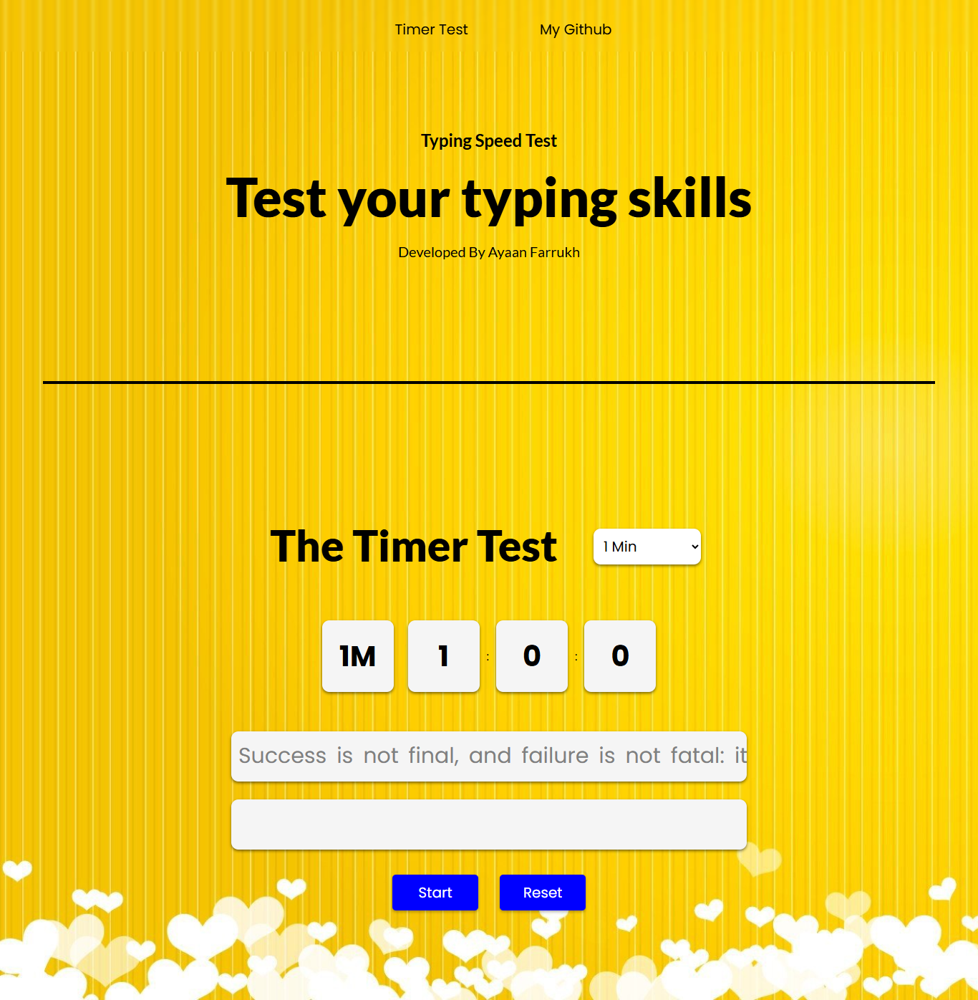

# Typing Test App 🖋️⌨️

A modern, responsive typing speed test built with HTML, CSS, and JavaScript. Designed to measure and improve typing speed and accuracy in real-time, the app includes live performance metrics like **WPM**, **CPM**, and **Accuracy**, and supports multiple test durations.

---

## ✨ Features

- ⏱️ Timer selection (1, 2, or 3 minutes)
- 🧠 Real-time accuracy and performance tracking
- 💾 LocalStorage support to retain results across sessions
- 🎯 Word-by-word validation with instant visual feedback
- 🔁 Reset and retest options
- 📱 Fully responsive design

---

## 📸 Screenshots

;

---

## 🛠️ Built With

- HTML5
- CSS3 (Flexbox, Media Queries)
- Vanilla JavaScript (ES6 Modules)

## 📈 Performance Metrics

- Words Per Minute (WPM) — calculated based on correctly typed words.
- Characters Per Minute (CPM) — based on total non-space characters typed.
- Accuracy — determined by comparing user input with the reference text.

## 🚀 Getting Started

Clone the repository:

```bash
git clone https://github.com/YourUsername/typing-test-app.git
cd Typing Speed Test
```

## Project Structure

```bash
/typing-test-app
│
├── index.html         # Main HTML file
├── style.css          # All styles
├── script.js          # Core logic and event handling
├── data.js            # Typing texts storage
├── /assets            # Images and other static assets
```

## Author

- Ayaan Farrukh
